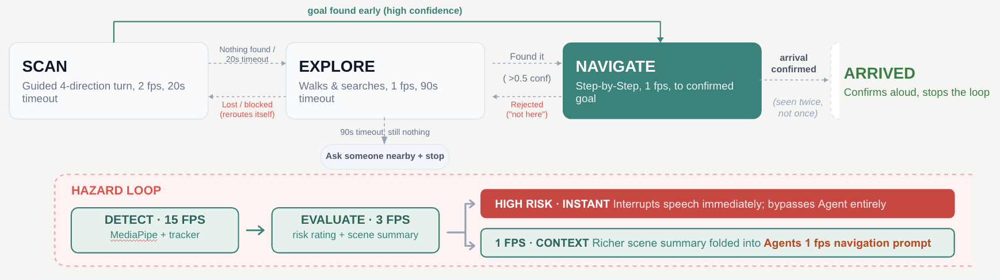
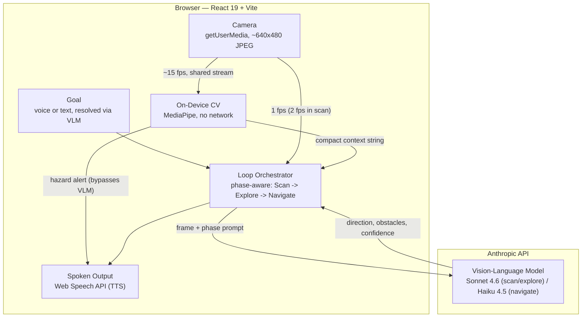
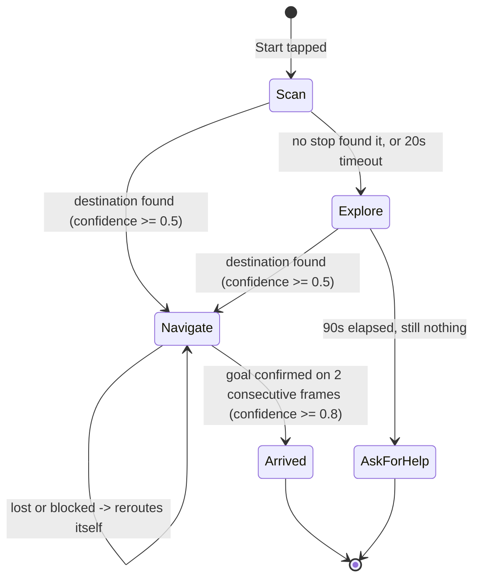

# VisionGuide

**AI-powered indoor navigation for visually impaired users — a phone camera and a vision-language model, no beacons or building infrastructure required.**

Built at [Dallas AI](https://dallas-ai.org) · Team 13 · June 2026
[Live demo](https://visionguide-navy.vercel.app) · [Team & credits](#team)

[](https://www.youtube.com/watch?v=H2d_SXiEZSg)
[](https://www.youtube.com/watch?v=H2d_SXiEZSg)

## Contents

- [The Problem](#the-problem)
- [What VisionGuide Does](#what-visionguide-does)
- [Core Features](#core-features)
- [Architecture](#architecture)
- [Tech Stack](#tech-stack)
- [Repository Structure](#repository-structure)
- [Key Design Decisions](#key-design-decisions)
- [Running Locally](#running-locally)
- [Safety & Limitations](#safety--limitations)
- [Roadmap](#roadmap)
- [Team](#team)
- [References](#references)

---

## The Problem

GPS solved outdoor navigation. It doesn't work indoors — and for roughly 340 million people living with vision impairment, that gap shows up daily: in hospitals, transit hubs, shopping malls, and office buildings they're visiting for the first time. Existing fixes (Bluetooth beacons, pre-mapped floor plans) need building-specific infrastructure — expensive to deploy, and covering a tiny fraction of the real-world spaces people actually navigate.

There's no independent way for a visually impaired person in an unfamiliar building to locate a door, avoid an obstacle, or read a sign — without asking someone else.

*The same camera-only approach points toward a related need we're exploring: helping patients navigate safely at home during post-discharge recovery, when temporary mobility, cognitive, or visual changes can make a familiar space feel unfamiliar again.*

## What VisionGuide Does

VisionGuide turns a standard smartphone into a navigation assistant using only its camera. No beacons, no pre-installed maps, no building cooperation required.

A user states a destination out loud. The app scans the room, sends what it sees to a vision-language model, and speaks short, grounded directions — "Turn left, doorway ahead" — while a parallel on-device hazard layer watches for anything dangerous close enough to matter, independent of the network. On arrival, it says so and stops.



---

## Core Features

**Voice-First Destination Entry**
- Auto-listens for a destination the moment the app opens — no tap required to start.
- A manual microphone button and text field are always available as fallback.
- Free-form phrasing is understood, not just fixed commands: "the elevator," "I need to wash my hands," and "there's a meeting in room 204, get me there" all resolve to a usable destination. A brief spoken confirmation catches noisy input before it derails a session.

**Guided Scan & Explore**
- Every session opens with a gyroscope-gated 4-direction scan (ahead, right, behind, left) to find the destination or the most open path before the user starts walking.
- If the destination isn't found in the scan, explore phase keeps the user moving toward hallways and signage instead of stalling in place.

**Grounded Navigation Guidance**
- Directions are short (8–10 words), specific, and tied to what the camera can actually see — never a guess about what's behind the user or through a closed door.
- The destination is remembered briefly if it drifts out of frame, so guidance can route back toward it instead of treating it as lost.

**Layered Obstacle & Hazard Awareness**
- The VLM reports obstacles with urgency tiers — high interrupts speech immediately, medium queues after the current direction, low is logged silently.
- A parallel on-device hazard layer watches the camera feed independently of the network, so a close, dangerous obstacle can trigger an alert in milliseconds rather than waiting on a round trip.

**Accessibility by Default**
- Fully operable via screen reader (TalkBack / VoiceOver) — no interaction requires looking at the screen.
- WCAG AA contrast, large tap targets, and a spoken safety disclaimer (use alongside a cane or other mobility aid) at the start of each day's first session.
- An analyzed-frame preview and hazard overlay let a sighted companion or demo audience see exactly what the app is reacting to — a diagnostic aid, not part of the primary experience.

---

## Architecture

VisionGuide is two independent perception loops sharing one camera stream and one voice — a client-only React app that calls the Anthropic API directly. There is no backend, no database, and no proxy server; the browser holds the API key and calls `api.anthropic.com` straight from the client.



**Why two loops instead of one:** the VLM path is accurate but slow (network round trip, 1–3s depending on phase). The on-device path is fast but shallow (object detection, not scene understanding). Splitting them means a person stepping directly into the user's path gets an alert in milliseconds, while destination-finding and turn-by-turn guidance still get the VLM's actual scene understanding.

### The Phase Loop

Every session starts with a guided 4-direction scan and moves through explore and navigate as the destination is found:



- **Scan** (2 fps): four ~90° turns (ahead, right, behind, left), gyroscope-gated so a frame is only captured once each turn actually completes. Exits early the moment any stop finds the destination.
- **Explore** (1 fps): the user is walking now — guidance shifts to open hallways and signage if the destination still isn't visible, with a 90-second ceiling before the app asks the user to find someone nearby.
- **Navigate** (1 fps): short, grounded turn-by-turn directions to a destination that's already been located. If the path reads blocked for 4 consecutive frames, the app reroutes on its own rather than repeating a direction that isn't working.
- **Arrival** requires the destination to be confirmed on two consecutive frames, not one — a single high-confidence frame isn't enough to announce arrival and stop the loop.

### The Hazard Layer

Running the entire time, independent of the phase above: a MediaPipe object detector at ~15 fps feeds an IoU tracker, which a hazard evaluator checks roughly 3 times a second. A close, confirmed high-risk object interrupts speech immediately — no confirmation delay, since waiting even one more frame would consume the entire safety margin at this latency. It defers to whatever the app is already saying mid-sentence rather than talking over it, and won't repeat the same alert inside a few seconds, so a stationary hazard doesn't turn into alert spam.

---

## Tech Stack

| Layer | Choice | Why |
|---|---|---|
| Frontend | React 19 + Vite | Fast dev loop, no framework overhead needed for a single-session, single-screen-flow app. Plain JavaScript/JSX — no TypeScript. |
| Vision-language model | Anthropic Claude API — Sonnet 4.6 (scan/explore), Haiku 4.5 (navigate) | Model choice is swapped per phase: Sonnet for signage-reading accuracy where it matters most, Haiku for the highest-frequency, lower-stakes navigate-phase polling. |
| On-device CV | `@mediapipe/tasks-vision` (EfficientDet-Lite0) | Runs the hazard layer with zero network dependency. The WASM runtime and `.tflite` model are self-hosted in `public/`, not loaded from a CDN, so hazard detection never depends on a third-party host being reachable. |
| Styling | Inline `styles` objects reading tokens from `src/theme.js` | No CSS framework or component library — a deliberate constraint (`code-standards.md`) to keep the app lightweight and every screen consistent through one shared palette/type-scale module. |
| Fonts | Public Sans (display) + Atkinson Hyperlegible (body), via Google Fonts | Atkinson Hyperlegible is designed for low-vision legibility. |
| Browser APIs | `getUserMedia`, `SpeechRecognition`, `SpeechSynthesis`, `DeviceMotionEvent`, `WakeLock` | Camera, voice in/out, gyroscope-gated scan-turn detection, and keeping the screen awake during navigation — all native, no polyfill libraries. |
| Linting | ESLint 10, `eslint-plugin-react-hooks`, `eslint-plugin-react-refresh` | `public/mediapipe` and `public/models` are excluded — vendored/generated assets, not linted. |
| Deployment | Vercel, static build only (`vite build` → `dist/`) | No serverless functions, no backend. The browser calls `api.anthropic.com` directly with the API key from `VITE_ANTHROPIC_API_KEY`, using the `anthropic-dangerous-direct-browser-access` header. |

No backend, database, or auth layer exists or is planned for this scope — the browser *is* the whole app.

---

## Repository Structure

```
visionguide/
├── src/
│   ├── App.jsx                    ← top-level state: Onboarding → Set-destination → Navigating → Arrived
│   ├── main.jsx                   ← React entry point
│   ├── constants.js                ← every tunable threshold/interval, named and commented
│   ├── theme.js                    ← shared color/font design tokens (no CSS framework)
│   │
│   ├── components/
│   │   ├── Onboarding.jsx          ← entry screen; sole trigger for auto-listen (Web Speech needs a user tap first)
│   │   ├── GoalInput.jsx           ← destination text field + manual mic button
│   │   ├── StartStopButton.jsx     ← Start / Stop control
│   │   ├── StatusDisplay.jsx       ← aria-live status/error announcement strip
│   │   ├── NavigatingView.jsx      ← full-screen analyzed-frame background + spoken instruction banner
│   │   ├── DetectionOverlay.jsx    ← SVG bounding-box overlay for CV detections (demo/diagnostic only)
│   │   ├── ArrivedView.jsx         ← arrival confirmation screen
│   │   └── CameraPreview.jsx       ← hidden <video> element keeping the camera stream alive
│   │
│   ├── modules/
│   │   ├── loop.js                 ← the phase-aware navigation loop: owns Scan -> Explore -> Navigate
│   │   ├── guidedScan.js           ← 4-direction scan sequence, per-leg turn staging, decide()
│   │   ├── gyroscope.js            ← DeviceMotionEvent wrapper: turn-rate/angle tracking for scan gating
│   │   ├── camera.js               ← getUserMedia init, frame capture to base64 JPEG, WakeLock
│   │   ├── destination.js          ← resolves raw voice/text input to a clean destination via the VLM
│   │   ├── recognition.js          ← SpeechRecognition wrapper (voice input)
│   │   ├── speech.js               ← SpeechSynthesis queue: interrupt/queue/dedup logic
│   │   ├── obstacles.js            ← routes VLM-reported obstacles by urgency tier
│   │   ├── goalTracker.js          ← tracks consecutive goal-found frames, fires arrival
│   │   ├── goalMemory.js           ← remembers the destination's last-seen direction when out of frame
│   │   ├── spatialMemory.js        ← remembers recently-blocked headings to avoid repeat dead ends
│   │   ├── landmarks.js            ← landmark context hints threaded into VLM prompts
│   │   │
│   │   ├── cvDetector.js           ← on-device MediaPipe object detector loop (~15 fps)
│   │   ├── cvTracker.js            ← IoU centroid tracker across detector frames
│   │   ├── cvWorldModel.js         ← atomic snapshot store shared by the medium/slow loops
│   │   ├── hazardEvaluator.js      ← ~3 fps hazard evaluation + alert routing, defers to active speech
│   │   └── cvContextBuilder.js     ← formats qualifying CV detections into a compact context string
│   │
│   ├── api/
│   │   └── claude.js               ← sole browser-to-Anthropic fetch wrapper; builds request, parses response
│   ├── prompts/
│   │   └── system.js               ← all VLM prompt builders (navigate/explore/guided-scan/destination)
│   └── utils/
│       └── estimateRisk.js         ← pure function: detected object -> risk tier
│
├── public/
│   ├── mediapipe/                  ← self-hosted WASM runtime for the on-device detector (no CDN)
│   └── models/efficientdet_lite0.tflite  ← the on-device detection model
│
├── context/
│   ├── project-overview.md         ← quick orientation: what it is, user flow, features, scope
│   ├── specifications/
│   │   ├── visionguide-prd.html    ← authoritative PRD: goals, requirements, architecture, API contract
│   │   └── 01–13-*.md              ← per-feature specs (setup, weekly builds, scan phase, CV layer, ...)
│   ├── code-standards.md           ← implementation conventions
│   ├── ai-workflow-rules.md        ← spec-driven development workflow
│   ├── progress-tracker.md         ← live record of what's actually built, decisions, open questions
│   └── planning/                   ← demo-day runbook, demo route, pitch-deck outline, prompt-tuning log
│
├── AGENTS.md                       ← required reading order for AI coding agents working in this repo
├── CLAUDE.md                       ← general coding-agent behavioral guidelines
└── codereview/                     ← code-review process docs
```

---

## Key Design Decisions

**Spec-driven, not vibe-coded**
Every feature has a written spec (`context/specifications/`) — requirements, component design, acceptance criteria — agreed before implementation starts. `AGENTS.md` and `CLAUDE.md` enforce this for AI coding agents working in the repo: read the PRD and current specs first, never invent undocumented behavior, update `progress-tracker.md` after every meaningful change. It's why `context/` is as substantial as `src/` — the docs are the source of truth the code is built against, not an afterthought written after the fact.

**No backend, database, or proxy server**
The browser calls the Anthropic API directly. On a system already budgeting every second — ≤3s frame-to-speech at the target latency — adding a server hop in between would cost a full extra round trip for a feature (persistence, auth) this MVP doesn't need. The honest tradeoff: the API key ships in client-side JS, visible to anyone who opens dev tools. The mitigation is a hard $5/month spend cap enforced server-side in the Anthropic console, plus a separate scoped, revocable key for any public demo link — not application code, since app code can't protect a key that's already in the client bundle. Not a decision to repeat for a product handling real user accounts, but a reasonable one for a single-session MVP with nothing to steal. If it ever needs to move beyond that, `src/api/claude.js` is already the sole call site for every Anthropic request — swapping in a thin proxy later is an isolated change, not a rearchitecture.

**17 single-purpose modules, not one big loop file**
`code-standards.md` calls for small, single-purpose modules, and `src/modules/` holds to it — 17 files, 2,029 lines, ~120 lines average. That average is pulled up by `loop.js` (547 lines) alone; every other module stays under 200 lines, most well under 100. `loop.js` is the deliberate exception: it's the one place that owns the phase state machine and ties every other module together, so some size there is the cost of having a single orchestrator instead of scattering that logic across files.

**High-urgency obstacle alerts skip the confirmation frame everything else gets**
Destination arrival waits for two consecutive matching frames before acting, to avoid false positives. High-urgency obstacles are the deliberate exception — at a ~1 fps pipeline with multi-second latency, waiting even one more frame to confirm a hazard would consume the entire safety margin the alert exists to protect. The tradeoff is a higher false-positive rate on hazard alerts specifically, accepted on purpose: a false alarm costs a wasted "watch out"; a missed one doesn't.

**Onboarding shows on every visit, not just the first**
This looks like a missing "skip for returning users" feature until you know why: mobile Chrome silently blocks `speechSynthesis.speak()` and speech recognition unless triggered by a real, in-page user tap — and that permission doesn't carry over from a previous visit. An earlier version tried to auto-listen the instant the page loaded and went completely silent on-device, with no error thrown. Onboarding's tap is what unlocks audio for that session, so it can't be skipped without breaking voice entirely.

---

## Running Locally

### Prerequisites
- Node 18+ and npm
- An [Anthropic API key](https://console.anthropic.com/) with access to `claude-sonnet-4-6` and `claude-haiku-4-5-20251001`
- A browser with camera + microphone access — Chrome (desktop or Android) or Safari/Chrome on iOS for real device testing

### Setup

```bash
git clone https://github.com/FayyazMakhani/visionguide.git
cd visionguide
npm install

cp .env.example .env
# then edit .env and set VITE_ANTHROPIC_API_KEY to your key
```

### Scripts

| Command | What it does |
|---|---|
| `npm run dev` | Starts the Vite dev server at `http://localhost:5173` |
| `npm run build` | Production build to `dist/` |
| `npm run preview` | Serves the production build locally, for a final check before deploying |
| `npm run lint` | Runs ESLint |

Open the dev server URL in Chrome and allow the camera and microphone prompts. `localhost` is treated as a secure context, so camera access works over plain HTTP during local development — no HTTPS setup needed on your machine.

### Testing on a Real Phone

VisionGuide is built to be used on a phone, and a desktop browser can't meaningfully exercise the voice-first, hands-free flow. `localhost` being a secure context doesn't extend to other devices on your network, so `http://<your-LAN-IP>:5173` on a phone will not get camera/mic permission. Two options:

1. **Deploy a preview** — `vercel` from the project root gives you a real HTTPS URL to open directly on the phone.
2. **USB debugging** — connect an Android phone via USB, enable USB debugging, and use `chrome://inspect` on desktop Chrome to both load the dev server on the phone and inspect its console/accessibility tree remotely.

---

## Safety & Limitations

### Safety

**VisionGuide is a supplemental navigation aid, not a replacement for a cane, guide dog, or other primary mobility aid.** It makes probabilistic judgments from a camera feed and will sometimes be wrong — including reporting a path as clear when it isn't. A spoken safety reminder plays at the start of each day's first session and cannot be skipped.

The system runs at roughly 1 frame per second with a few seconds of processing latency end to end. At a normal walking pace, that's several meters of travel between a frame being captured and its guidance being spoken. VisionGuide is built for deliberate, cautious movement — not normal walking speed — and users should keep using their primary mobility aid at all times during navigation.

### Known Limitations

- **Table detection is unreliable.** Chairs and other close furniture detect and alert consistently; tables score too low on the on-device model to guarantee detection without introducing false positives elsewhere. A larger detection model is the noted follow-up.
- **Guided-scan turn angles are approximate**, not exact — they're derived from integrated gyroscope rotation rate, which drifts over time. A tolerance window absorbs some of this, but it's an estimate, not a measurement.
- **Single session, single destination.** There's no persistence across sessions, no multi-floor awareness, and no user accounts — starting over always begins at the guided scan.

### Supported Platforms

- iOS Safari 16+ / Chrome on iOS 16+ (WebKit)
- Chrome 120+ on Android 10+
- Requires a device with a rear camera and microphone, served over HTTPS (or `localhost` for local dev) — the camera and speech APIs require a secure context, and the app has no meaningful fallback without them.

---

## Roadmap

- **Custom-trained CV model** — fine-tune the on-device detector on real indoor-specific data (hazards, landmarks, structural features) instead of the general-purpose EfficientDet-Lite0 model currently in use. A larger model is also the known path to reliable table detection, which the current model can't guarantee — see Known Limitations above.
- **Native mobile app** — a native iOS/Android app for lower latency than the current web app, with eyes-free voice activation (e.g. Siri Shortcuts on iOS).
- **Multi-language support** — voice input, VLM prompts, and spoken output are all English-only today; localizing each for broader reach.
- **Multi-floor navigation** — 3D localization and routing across elevators, stairs, and escalators. Explicitly out of scope for the current single-floor MVP.

---

## Team

Built at [Dallas AI](https://dallas-ai.org) — the largest nonprofit AI professional community in Dallas-Fort Worth — as Team 13's project, June 2026.

| Name | Role |
|---|---|
| Monica Mahajan | Product Manager |
| Pranil Lama | Technical Lead |
| Fayyaz Makhani | Technical Lead |
| Tasnim Dulla | Market Research & Design Lead |
| Arjun Palaniappan | Analyst |
| Sreevishnu Chennapragada | Analyst |
| Maithra Palipudi | Analyst |
| Pavan Ghantasala | Mentor |

---

## References

**Datasets & Models**
- Ultralytics. "COCO Detection Dataset." *Ultralytics Documentation*, docs.ultralytics.com/datasets/detect/coco — training data behind the on-device detector's object classes.
- "Claude Sonnet 4.6." Anthropic, Feb. 2026, anthropic.com/news/claude-sonnet-4-6
- "Claude Haiku 4.5." Anthropic, anthropic.com/claude/haiku

**Research**
- Bourne, Rupert R. A., et al. "Trends in Prevalence of Blindness and Distance and Near Vision Impairment over 30 Years: An Analysis for the Global Burden of Disease Study." *The Lancet Global Health*, vol. 9, no. 2, 2021, pp. e130–e143, pubmed.ncbi.nlm.nih.gov/33275950 — source for the ~340 million prevalence figure in [The Problem](#the-problem).
- Manduchi, Roberto, and Sri Kurniawan. "Mobility-Related Accidents Experienced by People with Visual Impairment." users.soe.ucsc.edu/~manduchi/papers/MobilityAccidents.pdf — background on indoor mobility incident rates for visually impaired users.